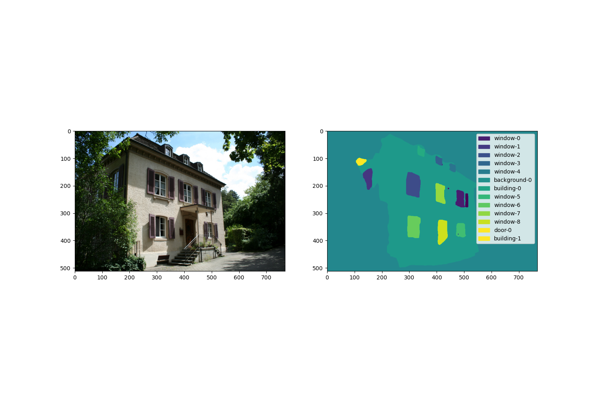
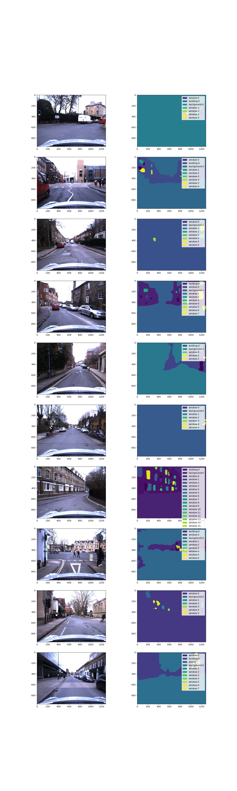
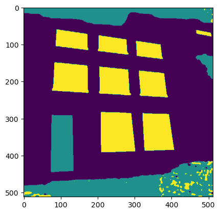
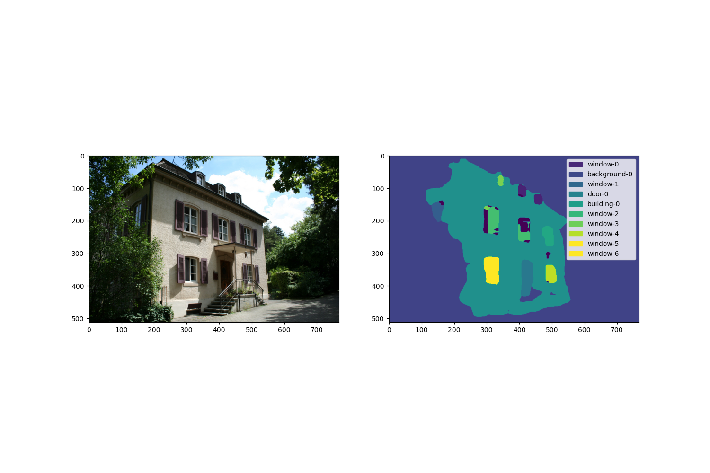

## Goal

 Given an image with (possibly multiple) facade(s),
1. Determine the number of windows;
2. Segment the facade;
3. (Optimistically) Determine the "main" building. 

## Results

1) [Uptrained semantic segmentation SegFormer](https://huggingface.co/galthran/segformer-facade/) with mIoU 0.7.
2) [Uptrained MaskFormer for panoptic segmentation](https://huggingface.co/galthran/maskformer-facade-panoptic) with more or less descent performance on counting windows. Differentiating between buildings failed miserably.



Segmentation on the test subset of cars dataset:



## Facade datasets overview

It is common to classify the object segmentation problem into two:

- Semantic segmentation -- assign semantic label to each pixel;
- Instance segmentation -- assign instance label to each pixel.

The combination of the two yields:
- Panoptic segmentation -- assign both semantic and instance labels to each pixel.

### Panoptic segmentation

 - [CMP](https://cmp.felk.cvut.cz/~tylecr1/facade/)
 - [Oxford Cars](https://github.com/sijieaaa/Oxford-RobotCar-Facade)
	 -  bad instance segmentation for buildings
 - [ETRIMS](http://www.ipb.uni-bonn.de/projects/etrims_db/)

### Semantic segmentation

- [TMBuD](https://github.com/CipiOrhei/TMBuD)
-  [ParisArtDecoFacades](https://github.com/raghudeep/ParisArtDecoFacadesDataset)
- [Facades dataset from pix2pix paper](https://www.kaggle.com/datasets/balraj98/facades-dataset) (likely intersected with CMP)
- [LabelMeFacade](https://github.com/cvjena/labelmefacade)

### Unlabeled
- [ZuBuD](https://icu.ee.ethz.ch/research/datsets.html#:~:text=Zurich%20Build%C2%ADings%20Data%C2%ADbase) 

### Missing datasets

The links are either broken or not open-sourced:
- [ECP](https://mldta.com/dataset/ecp-paris-2010/)
- [Graz50](https://mldta.com/dataset/ecp-paris-2010/)


## Solution general outline

### Tasks 2, 3

require panoptic segmented data.

The available datasets differ with respect to available semantic categories, so that a common format has to be defined and respectively converted to.
The resulting set of semantic classes is *essentially* the intersection of all available ones. 
The corresponding ```id2class``` mapping is given by:

	0: background
	1: building
	2: door
	3: window

The data is served by ```torch.utils.data.Dataset```, with the output format understood by ```transformers.MaskFormerModel```.

The choice of the model is motivated by the need to use data for otherwise different tasks. The same interface, the same ```Dataset``` can be used for all the tasks. Another necessary condition is that there are uptrained versions of the model on both the semantic and panoptic segmentation tasks. Besides, it allows for an interesting TODO.3 experiment.

As a result of by no means exhausting trainings, the resulting model succeeds in differentiating between different windows (and thus counting the number of those) (TODO: some test metric), however failed miserably.
This is unsurprising:
 - There was only a handful of train images with correctly segmented buildings (coming from CMP)
 - There was a pack of train images with incorrectly segmented buildings (coming from Oxford Cars) 

Limitations:
- Computational: I had to resort to plain GD (that is, ```batch_size = 1```)
	- Get bigger/multiple GPU(s)
	- Try fine-tuning a smaller model.

### Task 1

Depending on what we mean by facade segmentation, the solution either follows from the resulting from Task 2,3 model, or a simple semantic segmentation fine-tuning
More precisely, if segmenting ```window```s, ```door```s and the ```building``` is enough, then we are done.
If, however, more elements are required, then we uptrain the model with original, unconverted labels.


## A note on the infrastructure

```facade_datasets``` package is responsible for converting each respective dataset to the common format.
The structure is ```facade_datasets/${df_name}/```, which contains:
 - ```const.py``` -- defines the path to the data, mappings for original segmentation, mapping from original to converted segmentation.
 - ```convert.py``` -- the conversion script. Ought to be run as ```python -m facade_datasets.${dataset_name}.convert```
 - ```dataset.py``` -- both panoptic and semantic datasets definition.
 
 I find this design to be readily extentable. Essentially one only needs to write the conversion script.


The ```train.py``` and respective ```train_utils.py``` use the dataset with ```transformers.Trainer``` to finetune the model.
I split each dataset into train/val with 80/20 ratio.
There is a helper script```visualize_eval.py```, which produces the predicted segmentation images. 

## Experiments

The logs are in (experiments/) with format ```${experiment_name}/runs```. 
An experiment folder sometimes conatins an image with predicted segmentation. 
If it does not, then there was nothing to write home about.

I started by closely inspecting the datasets: [dataset_check.ipynb](dataset_check.ipynb)
Once I knew the datasets were fine, the conversino was successful, I started of with an easy semantic segmentation case problem:

### Task 1.

I succesfully overfitted a batch (a single image) ```segformer_etrims_overfit_batch```

The resulting image:



As seen, despite the loss being extremely small, there are still rather inadequate artefacts.
When I first started with the task, I hoped semantic segmentation would be sufficient. 
That from segmented windows picture one could algorithmically, deterministically count the number of windows.
While this makes sense, this picture suggest it is no trivial task.

I've uptrained the [nvidia/segformer-b3-finetuned-ade-512-512](https://huggingface.co/nvidia/segformer-b3-finetuned-ade-512-512).

The model (including metrics) is available at https://huggingface.co/galthran/segformer-facade/

TODO: provide resulting model segmentation example.

There is still room for performance improvement, namely, use all the purely semantic datasets.


### Task 2, 3

The main problem here was that I couldn't overfit the batch. The loss wouldn't go to zero even after. The details are:

- ```overfit_batch```
- ```overfit_batch__no_cars```
- ```overfit_batch__no_cmp```
- ```overfit_batch__new_normalize_all_ds```

The issue is still unresolved. Probably one has to continue training even further.
At any rate, I've procceded.

Interesting experiments are:

  - ```al_ds__5e5``` -- 256x256 images, learning rate 5e5, constant scheduler.
  


I did compute several metrics, ```mIoU```, ```n_missing_windows```, but they are most certainly flawed. 
(It turns out computing metrics with MaskFormer is untrivial -- see [```train_utils.py```](train_utils.py) and ```compute_metrics``` function in [train.py](train.py)
  
  - ```al_ds__512_5e6``` -- the main one, the resulting segmentations are shown in Results section.
  
I had a couple of other experiments 
  - with subset of all available data (e.g. ```no_cmp_5e5``), but the general observation is that all the data is useful;
  - with learning rates 5e5, 5e4, but the general observation is that 5e6 is more or less optimal.


## TODO

1. Panoptic segmentation metrics;
2. Segment Oxford Cars buildings;
3. Tune ```lr``` and other hyperparameters;
4. Try finetuning for semantic segmentation, **then** finetuning for the actual task
	- Obviously, the semantic segmentation datasets (which I didn't use) can be useful.
